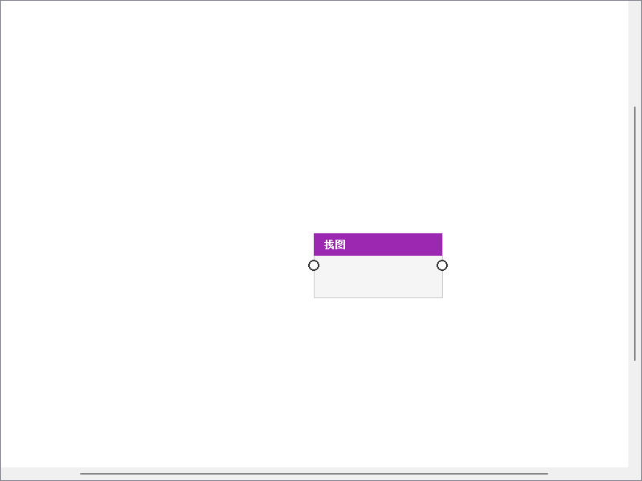

# 可视化键鼠自动化编辑器

基于 PyQt5 的节点编辑器，用于创建和执行键盘/鼠标自动化工作流。支持找图、找色、键盘鼠标模拟、条件判断、循环等丰富功能。



## 功能特性

- **可视化节点编辑**：拖拽式操作，支持条件分支和循环
- **单节点测试**：快速测试单个节点配置，使用 Mock 数据
- **链路测试**：从起点运行到指定节点，验证前置流程
- **找图找色**：基于 OpenCV 的图像识别功能
- **热键启动**：支持全局热键触发自定义工作流
- **实时日志**：执行过程实时输出到日志面板

## 安装要求

### 环境要求
- Python 3.8+
- Windows 系统（依赖 Windows API 模拟键鼠）

### 安装依赖

```bash
pip install PyQt5 pyautogui opencv-python numpy
```

### 快速启动

```bash
python main.py
```

---

## 操作手册

### 界面布局

```
┌─────────────────────────────────────────────────────────────┐
│  菜单栏  │  工具栏                                          │
├─────────┴───────────────────────────────────────────────────┤
│  ┌───────────┐  ┌─────────────────────────────────────────┐ │
│  │           │  │                                         │ │
│  │  节点库   │  │              节点画布                    │ │
│  │  (左侧面板)│  │            (中央编辑区)                  │ │
│  │           │  │                                         │ │
│  │ • 触发    │  │    ┌─────┐      ┌─────┐                │ │
│  │ • 动作    │  │    │找图 │──────│点击 │                │ │
│  │ • 图像    │  │    └─────┘      └─────┘                │ │
│  │ • 逻辑    │  │                                         │ │
│  │           │  │                                         │ │
│  └───────────┘  └─────────────────────────────────────────┘ │
├─────────────────────────────────────────────────────────────┤
│  属性面板 (下方/右侧，选中节点时显示参数)                       │
├─────────────────────────────────────────────────────────────┤
│  日志面板 (底部，显示执行日志)                                │
└─────────────────────────────────────────────────────────────┘
```

### 基础操作

#### 1. 创建节点

**方法一：拖拽**
1. 在左侧面板「节点库」中找到需要的节点
2. 按住鼠标左键，将节点拖拽到中央画布
3. 松开鼠标，节点即被创建

**方法二：右键菜单**
1. 在画布空白处右键点击
2. 选择「添加节点」→ 选择分类 → 选择节点类型

**方法三：双击**
- 在节点库中双击节点，会在画布中心创建该节点

#### 2. 连接节点

1. 将鼠标移动到源节点的**右侧输出端口**（白色圆点）
2. 按住鼠标左键，拖拽到目标节点的**左侧输入端口**
3. 松开鼠标，连线创建成功

**端口类型：**
- **单输入单输出**：大多数动作节点
- **单输入双输出**：条件节点（是/否）、循环节点（循环/结束）

#### 3. 删除节点/连线

- **删除节点**：
  - 选中节点，按 `Delete` 键
  - 或右键节点 → 「删除」
  - 删除节点会自动删除相关连线

- **删除连线**：
  - 选中连线，按 `Delete` 键
  - 或右键连线 → 「删除」

#### 4. 节点布局

- **移动节点**：左键拖拽节点
- **框选多个**：按住左键在画布上拖动框选
- **全选**：`Ctrl + A`
- **多选**：`Ctrl + 点击节点`

#### 5. 画布操作

- **平移画布**：按住鼠标中键（滚轮）拖拽
- **缩放画布**：滚动鼠标滚轮
- **清空画布**：右键 → 「清空画布」

---

## 节点详细说明

### 一、触发类节点

触发类节点是工作流的起点，用于启动自动化流程。

#### 1. 手动启动

**图标：** ▶️ **类型：** `start_manual`

**说明：**
用户点击工具栏的「运行」按钮或按 `F5` 键时触发。

**使用场景：**
- 手动测试工作流
- 一次性执行的任务

**参数：** 无

**输出变量：**
- `$started` (bool): 是否已启动，始终为 `True`

---

#### 2. 热键启动

**图标：** ⌨️ **类型：** `start_hotkey`

**说明：**
按下指定的热键组合时触发工作流。

**参数：**

| 参数名 | 类型 | 默认值 | 说明 |
|--------|------|--------|------|
| 热键 | string | F6 | 触发工作流的热键，如 F6, Ctrl+Shift+A |

**热键格式：**
- 单键：`F1`~`F12`, `a`~`z`, `0`~`9`
- 组合键：`ctrl+shift+f`, `alt+f4`

**使用场景：**
- 游戏中快速触发连招
- 工作中快速执行重复操作

**输出变量：**
- `$hotkey` (string): 触发的热键

---

### 二、动作类节点

#### 3. 鼠标移动

**图标：** 🖱️ **类型：** `mouse_move`

**说明：**
将鼠标光标移动到指定屏幕坐标。

**参数：**

| 参数名 | 类型 | 默认值 | 说明 |
|--------|------|--------|------|
| X坐标 | int | 0 | 屏幕横坐标，从左到右 |
| Y坐标 | int | 0 | 屏幕纵坐标，从上到下 |

**使用技巧：**
- 配合「找图」节点的 `$find_x`, `$find_y` 变量使用
- Windows 屏幕坐标：左上角为原点 (0, 0)

**输出变量：**
- `$x` (int): 移动到的 X 坐标
- `$y` (int): 移动到的 Y 坐标

---

#### 4. 鼠标点击

**图标：** 🖱️ **类型：** `mouse_click`

**说明：**
模拟鼠标点击操作，支持左键、右键、中键。

**参数：**

| 参数名 | 类型 | 默认值 | 选项 | 说明 |
|--------|------|--------|------|------|
| 按钮 | select | left | left/right/middle | 点击的鼠标按钮 |
| X坐标(可选) | int | 0 | - | 点击位置，留空则在当前位置点击 |
| Y坐标(可选) | int | 0 | - | 点击位置，留空则在当前位置点击 |

**使用场景：**
- 点击指定坐标：填写 X, Y
- 点击当前位置：不填写 X, Y
- 配合找图：X 填 `$find_x`，Y 填 `$find_y`

**输出变量：**
- `$button` (string): 点击的按钮

---

#### 5. 键盘按键

**图标：** ⌨️ **类型：** `key_press`

**说明：**
模拟按下单个按键，如回车、ESC、方向键等。

**参数：**

| 参数名 | 类型 | 默认值 | 说明 |
|--------|------|--------|------|
| 按键 | string | enter | 按键名称 |

**常用按键：**
- 功能键：`f1`~`f12`
- 方向键：`up`, `down`, `left`, `right`
- 控制键：`enter`, `esc`, `tab`, `space`, `backspace`
- 修饰键：`shift`, `ctrl`, `alt`
- 字母数字：`a`~`z`, `0`~`9`

**输出变量：**
- `$key` (string): 按下的按键

---

#### 6. 键盘输入

**图标：** ⌨️ **类型：** `key_input`

**说明：**
模拟输入一串文本，逐字符输入。

**参数：**

| 参数名 | 类型 | 默认值 | 说明 |
|--------|------|--------|------|
| 文本 | string | - | 要输入的文本内容 |

**使用场景：**
- 自动填写表单
- 输入账号密码（注意安全风险）
- 输入搜索关键词

**输出变量：**
- `$text` (string): 输入的文本

---

#### 7. 延时

**图标：** ⏱️ **类型：** `delay`

**说明：**
等待指定的时间，用于控制执行节奏。

**参数：**

| 参数名 | 类型 | 默认值 | 范围 | 说明 |
|--------|------|--------|------|------|
| 毫秒 | int | 1000 | 0~999999 | 等待的毫秒数 |

**常用时间：**
- 1 秒 = 1000 毫秒
- 0.5 秒 = 500 毫秒

**使用场景：**
- 等待页面加载
- 控制操作频率
- 等待动画完成

**输出变量：**
- `$milliseconds` (int): 延迟的毫秒数

---

### 三、图像类节点

#### 8. 找图

**图标：** 🖼️ **类型：** `find_image`

**说明：**
在屏幕上查找指定的图片，支持 OpenCV 模板匹配。

**参数：**

| 参数名 | 类型 | 默认值 | 说明 |
|--------|------|--------|------|
| 图片路径 | file | - | 要查找的图片文件路径 |
| 相似度阈值 | float | 0.8 | 0.0~1.0，越高越严格 |
| 查找区域 | region | 0,0,1920,1080 | [x, y, w, h]，全屏为 [0,0,1920,1080] |
| 找到后动作 | select | none | none/move/click/right_click/double_click |
| 随机偏移阈值 | int | 7 | 点击位置的随机偏移范围 |
| 固定偏移X | int | - | 点击位置的固定 X 偏移 |
| 固定偏移Y | int | - | 点击位置的固定 Y 偏移 |

**找到后动作选项：**
- `none`: 不执行动作，仅保存坐标
- `move`: 移动鼠标到找到的位置
- `click`: 左键点击
- `right_click`: 右键点击
- `double_click`: 双击

**偏移设置：**
- **随机偏移**：在找到的坐标周围随机偏移 ±N 像素，模拟人工操作
- **固定偏移**：在找到的坐标基础上增加固定的 X、Y 偏移

**使用技巧：**
1. 截图时使用自带的「截图工具」按钮
2. 图片尽量小，提高匹配速度
3. 相似度阈值根据图片质量调整

**输出变量：**
- `$found` (bool): 是否找到图片
- `$find_x` (int): 找到图片的 X 坐标（中心点）
- `$find_y` (int): 找到图片的 Y 坐标（中心点）
- `$confidence` (float): 匹配置信度

---

#### 9. 找色

**图标：** 🎨 **类型：** `find_color`

**说明：**
在指定区域查找指定颜色，返回第一个匹配的位置。

**参数：**

| 参数名 | 类型 | 默认值 | 说明 |
|--------|------|--------|------|
| 颜色 | color | #FF0000 | 十六进制颜色值，如 #FF0000 表示红色 |
| 容差 | int | 10 | 0~255，颜色匹配的容差范围 |
| 查找区域 | region | 0,0,1920,1080 | [x, y, w, h] |

**容差说明：**
- 容差为 0 时，只匹配完全相同的颜色
- 容差越大，匹配的颜色范围越广
- RGB 各通道分别计算容差

**输出变量：**
- `$found` (bool): 是否找到颜色
- `$color_x` (int): 找到颜色的 X 坐标
- `$color_y` (int): 找到颜色的 Y 坐标

---

### 四、逻辑类节点

#### 10. 条件判断

**图标：** 🔀 **类型：** `condition`

**说明：**
根据条件表达式的结果，选择执行「是」分支或「否」分支。

**参数：**

| 参数名 | 类型 | 默认值 | 说明 |
|--------|------|--------|------|
| 条件表达式 | string | $found == True | 支持变量和比较运算符 |
| 真分支标签 | string | 是 | 「是」分支的显示名称 |
| 假分支标签 | string | 否 | 「否」分支的显示名称 |

**端口：**
- 输入：1 个
- 输出：2 个（端口 0 = 是/True，端口 1 = 否/False）

**表达式语法：**

```
# 变量引用
$found == True           # 判断变量 found 是否为真
$x > 100                 # 判断 x 是否大于 100
$count >= 5              # 大于等于
$name == "test"          # 字符串比较

# 支持的操作符
==  等于
!=  不等于
>   大于
<   小于
>=  大于等于
<=  小于等于
and 逻辑与
or  逻辑或

# 复杂条件
$found == True and $confidence > 0.9
$x > 100 or $y < 50
```

**使用示例：**
1. 找图后判断是否找到：`$found == True`
2. 判断坐标范围：`$find_x > 500 and $find_x < 1000`

**输出变量：**
- `$condition_met` (bool): 条件结果（True/False）
- `$expression` (string): 使用的表达式

---

#### 11. 循环

**图标：** 🔄 **类型：** `loop`

**说明：**
重复执行循环体内的节点指定次数。

**参数：**

| 参数名 | 类型 | 默认值 | 范围 | 说明 |
|--------|------|--------|------|------|
| 循环次数 | int | 3 | 1~9999 | 重复执行的次数 |
| 循环变量名 | string | i | - | 循环计数器变量名 |

**端口：**
- 输入：1 个
- 输出：2 个（端口 0 = 循环体，端口 1 = 结束出口）

**循环变量使用：**
- `$i`：当前循环索引（从 0 开始）
- `$i+1` 或 `${i+1}`：当前循环次数（从 1 开始）

**连接方法：**
1. 「循环」出口连接循环体的第一个节点
2. 循环体最后一个节点不需要连接回循环节点（自动处理）
3. 「结束」出口连接循环结束后的节点

**使用示例：**
- 重复找图 5 次
- 批量处理多个项目

**输出变量：**
- `$count` (int): 循环次数
- `$loop_var` (string): 循环变量名

---

#### 12. 跳出循环

**图标：** ⏏️ **类型：** `break`

**说明：**
立即退出当前所在的循环。

**参数：** 无

**使用场景：**
- 找图成功后提前结束循环
- 满足特定条件时跳出

**注意：**
- 必须放在循环体内才有效
- 放在循环外会报错

**输出变量：**
- `$break` (bool): 始终为 `True`

---

#### 13. 继续循环

**图标：** ⏭️ **类型：** `continue`

**说明：**
跳过当前循环的剩余部分，进入下一次循环。

**参数：** 无

**使用场景：**
- 跳过某些条件的数据
- 配合条件节点使用

**输出变量：**
- `$continue` (bool): 始终为 `True`

---

## 测试功能

### 单节点测试（模式 A）

**用途：** 快速测试单个节点的配置，无需运行整个工作流。

**操作步骤：**
1. 在画布上右键点击要测试的节点
2. 选择「🧪 测试此节点」
3. 在弹出的 Mock 数据对话框中配置输入变量
4. 点击「🎲 自动生成 Mock 数据」可以快速填充随机值
5. 点击「确定」开始测试
6. 测试结果会保存，可后续查看

**特点：**
- 使用 Mock 数据模拟前置节点的输出
- 不影响工作流的全局变量状态
- 测试完成后自动恢复原始变量
- 节点会显示绿色边框（成功）或红色边框（失败）

---

### 运行到此处（模式 B）

**用途：** 从起始节点开始，经完整链路执行到选中节点，验证前置流程。

**操作步骤：**
1. 右键点击目标节点
2. 选择「▶ 运行到此处」
3. 如果路径上有条件节点，会弹出分支选择对话框
4. 选择要走「是」分支还是「否」分支
5. 点击「确定」开始执行

**特点：**
- 使用真实的节点逻辑和数据
- 遇到条件节点时需要用户选择分支
- 遇到循环节点时只执行一次循环体
- 到达目标节点后自动停止

---

### 查看测试结果

**操作：** 右键已测试的节点 → 「👁 查看测试结果」

**显示内容：**
- 测试时间
- 输出变量及其值

---

## 快捷键

| 快捷键 | 功能 |
|--------|------|
| `F5` | 运行工作流 |
| `Ctrl + S` | 保存工作流 |
| `Ctrl + O` | 打开工作流 |
| `Ctrl + A` | 全选节点 |
| `Delete` | 删除选中节点/连线 |
| `Ctrl + 滚轮` | 缩放画布 |
| `中键拖拽` | 平移画布 |

---

## 使用示例

### 示例 1：自动点击按钮

```
[手动启动] ──→ [找图: button.png] ──→ [条件: $found == True]
                                               │
                                       是(True) │ 否(False)
                                               ↓
                                          [鼠标点击]
                                               ↓
                                          [延时: 1000ms]
```

**说明：**
1. 找图查找 button.png
2. 条件判断如果找到
3. 如果找到，点击该位置
4. 等待 1 秒

---

### 示例 2：循环找图直到找到

```
[手动启动] ──→ [循环: 10次] ──→ [找图: target.png] ──→ [条件: $found == True]
        ↑                                              │
        │                                      是(True) │ 否(False)
        │                                              ↓
        └────────────────────────────────────── [跳出循环]
```

**说明：**
1. 最多尝试 10 次找图
2. 每次找 target.png
3. 如果找到，跳出循环
4. 如果没找到，继续下一次循环

---

### 示例 3：根据颜色判断

```
[手动启动] ──→ [找色: #00FF00] ──→ [条件: $found == True]
                                             │
                                     是      │      否
                                             ↓
                    ┌───────────── [按键: F1]    [按键: F2] ───────────┐
                    │                                                  │
                    └──────────────────────────────────────────────────┘
                                               ↓
                                          [结束]
```

**说明：**
1. 查找绿色 (#00FF00)
2. 如果找到，按 F1
3. 如果没找到，按 F2

---

## 注意事项

1. **权限问题**：找图、键鼠模拟需要足够的系统权限，请以管理员身份运行
2. **屏幕分辨率**：找图节点使用屏幕绝对坐标，分辨率变化后需要重新配置
3. **图片路径**：建议使用相对路径，将图片放在 `pic/` 目录下
4. **热键冲突**：热键启动时不要与其他软件的热键冲突
5. **变量作用域**：变量在整个工作流执行期间有效，可以被后续节点使用

---

## 文件说明

```
.
├── main.py                  # 程序入口
├── engine/                  # 执行引擎
│   └── workflow_engine.py   # 工作流执行逻辑
├── ui/                      # 用户界面
│   ├── main_window.py       # 主窗口
│   ├── node_canvas.py       # 节点画布
│   ├── node_library.py      # 节点库
│   ├── properties_panel.py  # 属性面板
│   ├── log_panel.py         # 日志面板
│   ├── mock_data_dialog.py  # Mock 数据对话框
│   ├── branch_select_dialog.py  # 分支选择对话框
│   └── screenshot_tool.py   # 截图工具
├── pic/                     # 截图存储目录
└── CLAUDE.md               # 开发文档
```

---

## 技术栈

- **GUI 框架**：PyQt5
- **图像处理**：OpenCV (cv2), NumPy
- **键鼠模拟**：PyAutoGUI
- **开发语言**：Python 3.8+

---

## 许可证

MIT License

---

## 更新日志

### v1.0.0 (2026-03-15)
- ✨ 初始版本发布
- ✨ 支持 13 种节点类型
- ✨ 单节点测试功能
- ✨ 链路测试功能
- ✨ 找图找色功能
- ✨ 条件分支和循环
